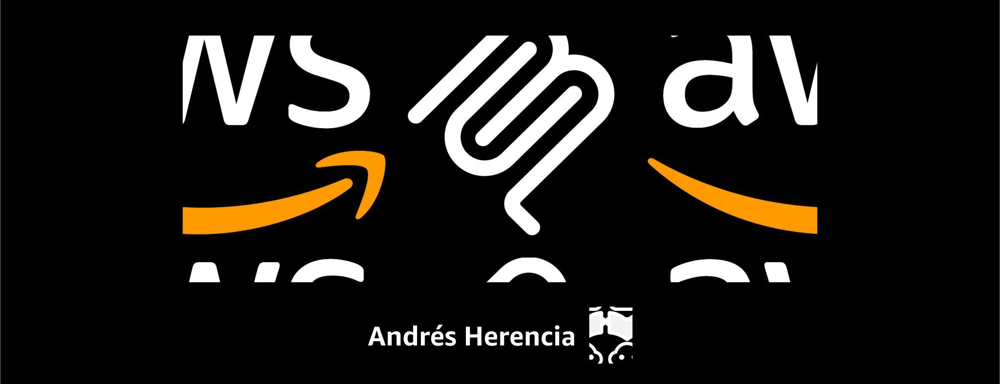

# AWS CLI MCP

<center>

</center>

An AI-powered agent to execute Amazon Web Services (AWS) CLI instructions using a server based on the Model Context Protocol (MCP).

## Prerequisites

1. **Python environment**
   Ensure you have Python 3.12+ and `uv` installed to manage dependencies.
2. **Environment variables**
   Create a `.env` file in the project root with your Azure OpenAI credentials:
   ```bash
   AZURE_OPENAI_ENDPOINT=your-endpoint-here
   AZURE_OPENAI_KEY=your-key-here
   AZURE_OPENAI_API_VERSION=2024-05-01-preview
   ```
3.	Install dependencies
    ```bash
    uv sync
    ```
Setting up the **S3 Tool Server**

Before running the **CLI**, you must instantiate the MCP server for AWS S3:

1. Open the file:

```bash
src/domain/tools/s3.py
```

This server provides the `list_s3_buckets` tool (and potentially others).

2.	Run the server (example with uv):

```bash
uv run python src/domain/tools/s3.py
```

The server will expose an **HTTP** endpoint (e.g., `http://localhost:8000/mcp/s3`). 

> [!NOTE]
> An HTTPs domain is required in order to use the OpenAI API.

## Configuring Tools

Define your tools in a JSON file (tools.json by default). Example:

```json
[
  {
    "type": "mcp",
    "server_label": "aws-s3",
    "server_url": "http://localhost:8000/mcp/s3",
    "allowed_tools": ["list_s3_buckets"],
    "require_approval": "never"
  }
]
```

This file must be passed to the CLI with `--tool-config` tools.json (or left as default).

## Running the CLI

The CLI entrypoint is in `src/application/interfaces/cli.py`. You can run it with:

```bash
uv run python -m src.application.interfaces.cli <command> [options]
```

## Commands

### 1. Chat

Interactive chat with the model using **MCP tools.**

```bash
uv run python -m src.application.interfaces.cli chat \
  --tool-config tools.json \
  --system "Provide answers to the user queries using the specified tools" \
  --llm-params '{"temperature":0.2,"max_output_tokens":800}'
```

* `--tool-config`: Path to your JSON with MCP tool specs (default: `tools.json`)
* `--system`: Initial system prompt (default: "Respond the user queries based on the provided tools")
* `--llm-params`: JSON object with LLM kwargs (optional, e.g., `{"temperature":0.2}`)

If you pipe input, it runs one-shot:

```bash
echo "List my S3 buckets" | uv run python -m src.application.interfaces.cli chat
```

If no input is piped, it runs interactively:

```bash
uv run python -m src.application.interfaces.cli chat
```

### 2. Parse

Structured outputs mode (Responses.parse) with a Pydantic schema.

```bash
echo "Return JSON with `buckets` as a list of names." | \
uv run python -m src.application.interfaces.cli parse \
  --tool-config tools.json \
  --system "Respond the user queries using the specified tools" \
  --output-format src.domain.my_schemas:BucketList \
  --llm-params '{"temperature":0.0}'
```
  
Previous params plus:
* `output-format`: Dotted path to a Pydantic schema for structured outputs.

## Example Workflow

1. Start the **S3 MCP server**:

```bash
uv run python src/domain/tools/s3.py
```

2. Ensure **`tools.json`** points to the server:

```json
[
  {
    "type": "mcp",
    "server_label": "aws-s3",
    "server_url": "http://localhost:8000/mcp/s3",
    "allowed_tools": ["list_s3_buckets"],
    "require_approval": "never"
  }
]
```

3. In other CMD window, **run chat** interactively:

```bash
uv run python -m src.application.interfaces.cli chat
```

Example session:

```bash
Interactive chat. Ctrl+C to exit.
> give a complete list of s3 buckets in my aws account
Sure! Here is the list of S3 Buckets for your AWS Account:

...
```
